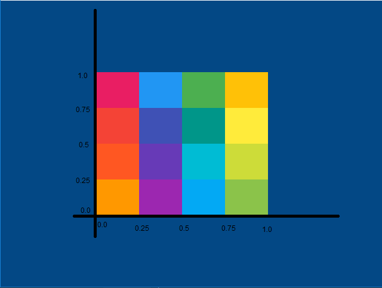

# Checkpoint 5 -- Applying a texture

Starting from checkpoint 4, with old explanatory comments removed

We add a texture, and sample it for the color instead of a color index. We change the color index (a single float) into UV coordinates, which are then used to look up in the texture. 

We use a small texture of size 4x4, with each texel having its own unique color. We set up the UV coordinates such that half the texture left part of the texture is on the left rectangle, and vice versa.

Shaders are adjusted appropriately.

### Illustration
The following illustration shows what UV coordinates corresponds to each color in the texture.




### Code statistics

Output from [cloc](https://github.com/AlDanial/cloc):
```
-------------------------------------------------------------------------------
Language                     files          blank        comment           code
-------------------------------------------------------------------------------
C                                1             75              6            247
GLSL                             2              7              0             17
-------------------------------------------------------------------------------
SUM:                             3             82              6            264
-------------------------------------------------------------------------------
```